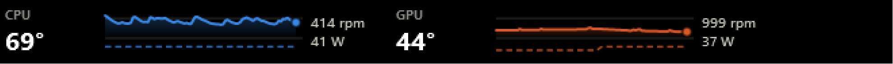

# Taskbar Temp Widget

A CPU/GPU temperature strip that sits on the Windows 11 taskbar.



Each half shows one component: its current temperature as a hero number, a
sparkline of the last three minutes, a dashed line for fan speed, and the fan
RPM and package wattage. About 14 KB of executable, no installer, no service,
no telemetry.

## Why this exists

Windows 11 removed the deskband API, so nothing can live *inside* the taskbar
any more — that is what killed NetSpeedMonitor and friends. The usual
alternatives (HWiNFO's Sensor Panel, Rainmeter with HWiNFO shared memory) both
need a paid HWiNFO Pro licence. This is a small, free, self-contained
alternative: a borderless click-through window positioned over an empty stretch
of the taskbar.

## Requirements

- Windows 11 (tested on 26200) with a dark taskbar
- [FanControl](https://github.com/Rem0o/FanControl.Releases) installed — the
  sensor service borrows the `LibreHardwareMonitorLib.dll` that ships with it,
  rather than bundling a second copy of the sensor stack
- Nothing else. It builds with the `csc.exe` already present on every Windows
  install, so there is no .NET SDK, NuGet or build system to set up.

## How it works

Two processes, deliberately:

| | runs as | job |
|---|---|---|
| `sensor-service.ps1` | **elevated** | polls the sensors every 2 s, writes `live.txt` |
| `Widget.exe` | normal user | reads `live.txt` every 2 s, draws the strip |

Reading motherboard and CPU sensors needs kernel-level access. Splitting the
two keeps the privileged part to a single PowerShell script that only ever
writes one text file, instead of running the whole GUI as administrator.

`live.txt` is written to a temp name and renamed into place, so the widget can
never read a half-written file. If the newest reading is more than 15 seconds
old the strip dims itself and says `sensors offline` — a monitor that silently
shows frozen numbers is worse than one that admits it has stopped.

## Setup

**1. Find your sensor names.** They differ between motherboards and GPUs. From
an elevated PowerShell:

```powershell
.\tools\list-sensors.ps1
```

Copy the `TYPE|Name` strings you want into the `$Want` table in
`src/sensor-service.ps1`. Keep the type prefix — several sensors share a name
across types (`GPU Core` exists as both `Temperature` and `Load`, `CPU Fan` as
both `Fan` and `Control`), and keying on the name alone lets one overwrite the
other.

**2. Set your fan maxima.** Set `$RpmMaxCpu` and `$RpmMaxGpu` to your fans' top
speed. Fan speed is published as a percentage of maximum so the dashed line has
a stable scale; FanControl's calibration will tell you the numbers.

Rather than editing `src/sensor-service.ps1`, you can copy
`docs/config-local.example.ps1` to `src/config.local.ps1` and put your values
there. That file is gitignored and is dot-sourced after the defaults, so it can
override any setting, extend `$Want` with extra sensors, and point `$CsvLog` at
a CSV log — which keeps machine-specific values out of the tracked script and
survives a `git pull`.

**3. Choose where it sits.** From a normal PowerShell:

```powershell
.\tools\measure-taskbar.ps1
```

Take the right edge of the Widgets button and the left edge of Start, and put
them into `LEFT_BOUND` / `RIGHT_BOUND` in `src/Widget.cs`. The window is
centred in that gap.

**4. Build and install.**

```powershell
.\tools\build.ps1                    # normal PowerShell
.\tools\install.ps1                  # elevated
```

`install.ps1` registers two logon tasks — the service with highest privileges
(so there is no UAC prompt at every logon) and the widget with normal rights —
and starts both immediately.

To remove it:

```powershell
Unregister-ScheduledTask -TaskName 'Taskbar Temp Widget - sensor service' -Confirm:$false
Unregister-ScheduledTask -TaskName 'Taskbar Temp Widget - display' -Confirm:$false
```

## Design notes

These are the decisions that took the longest to get right, kept here so
nobody has to rediscover them.

**No dual-axis chart.** Temperature (°C) and fan speed (RPM) are different
measures. Drawing them against one y-scale would make their crossings and
relative heights meaningless — it is the single most common charting mistake.
Each gets its own lane, separated by a hairline, sharing only the time axis.

**The temperature scale is fixed at 30–95 °C, not auto-fitted.** An auto-scaled
sparkline lies: a flat line at 90 °C looks identical to a flat line at 45 °C.
With a fixed domain the height of the trace means something, and the CPU is
directly comparable to the GPU. A reference line marks 80 °C.

**No hover layer.** The window has to be click-through or it would block the
taskbar underneath. So the current value is always printed as text and the
reference line gives the scale an anchor — the chart is readable without
interaction.

**Transparency costs ClearType.** WPF disables subpixel antialiasing on layered
windows, which is visible on 9–10 px text. Font weights are one step heavier to
compensate. If you prefer crisper text to a transparent background, set
`AllowsTransparency = false` and give the window an opaque `Background`.

**Check your taskbar's real colour before trusting contrast.** An acrylic
taskbar shows the wallpaper through it. Measure the pixels where the widget
will actually sit rather than assuming "dark taskbar" — a bright wallpaper can
leave white text on near-white pixels. On the machine this was built for the
strip's background measured `#152537`, dark and stable, so a transparent
background was safe.

**State is never colour alone.** Above 80 °C the value gets an amber glyph,
above 90 °C a red one; the number itself always carries the reading.

**Staying visible needs a nag loop.** The taskbar is topmost too, and within
that band the z-order goes to whoever called `SetWindowPos` last -- Explorer
re-asserts its own on every taskbar event, so opening the Start menu is enough
to bury the strip. A window cannot be raised *above* the taskbar's band by
`SetWindowPos` at all; that needs the `uiAccess` privilege, which needs a
signed binary in a trusted location. So the widget re-asserts topmost on its
own 250 ms timer. At 2 s the strip visibly blinked out when Start was pressed.

## Limitations

- Hardcoded for a 48 px taskbar at 100 % DPI. Other scalings need the sizes
  adjusting.
- The horizontal position is fixed at build time. With a centre-aligned taskbar
  the Start button drifts left as more apps open, so leave margin on the right.
- Single monitor: it places itself on the primary screen's taskbar.
- The `▲` glyph and `°` sign are non-ASCII literals, so `Widget.cs` must keep
  its UTF-8 BOM. `build.ps1` re-adds it before compiling.

## Licence

MIT — see [LICENSE](LICENSE).
